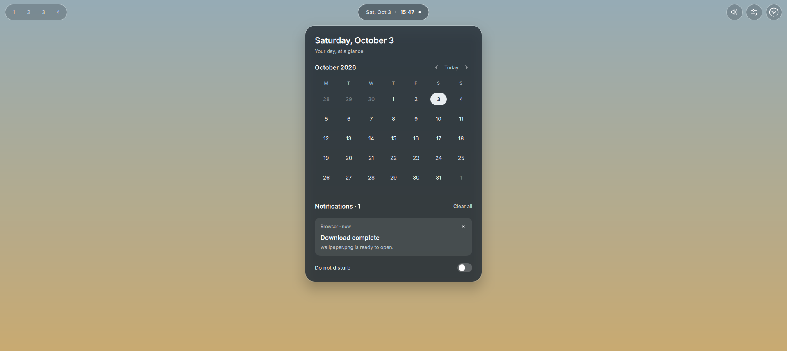

# nixos-dotfiles

Home Manager configuration for Hyprland (Lua config) with **BranchOS**, a Quickshell
desktop shell: a frosted top bar with a control center, quick settings, calendar and
notifications, sound and workspace popups.



## Requirements

- Linux with [Nix](https://nixos.org/download) (flakes are enabled by the scripts).
- A **Lua-capable Hyprland**, as in the locked nixos-unstable. Older releases that only
  read `hyprland.conf` can't load this config. Hyprland itself comes from the system.
- System services: PipeWire, UPower, power-profiles-daemon, BlueZ, and NetworkManager
  for the Wi-Fi/VPN controls. Controls whose service is missing show "Unavailable" or hide.

On NixOS, import [`modules/nixos/desktop.nix`](modules/nixos/desktop.nix) (or the flake's
`nixosModules.desktop`) into your system configuration. It enables everything above except
NetworkManager, which stays with your own networking setup.

## Install

```bash
git clone https://github.com/rosset-nocpes/nixos-dotfiles.git
cd nixos-dotfiles
scripts/install.sh            # build only
scripts/install.sh --switch   # build and activate for the current user
```

The first run writes `local.nix` with your username, home directory and system; edit it
if the detected values are wrong. It's ignored by Git. `--switch` uses the locked Home
Manager and renames any existing files it would replace to `*.hm-backup`. Run it as your
normal user on the target desktop, then log in to Hyprland. The shell starts with the
compositor; to start it in a running session use `quickshell -c branchos`.

Already using Home Manager? Import `homeModules.default` from this flake (or `home.nix`)
into your own configuration instead, and reconcile any existing Kitty, Hyprland or
Vicinae settings. Keep `home.stateVersion` at the value of your first Home Manager setup.

## Using the shell

| Pill | Click | Also |
| --- | --- | --- |
| Workspaces | Switch; click the current one for its windows | Scroll to move between workspaces |
| Clock | Calendar, notifications, Do not disturb | A dot means unread notifications |
| Tray | App action; right-click for its menu | Middle-click, scroll |
| Volume | Volume, mute, output device | Scroll to change volume |
| Quick settings | Wi-Fi, Bluetooth, Focus, Night light, brightness, Lock, Sleep, Power | |
| Duo ring | Control center | Wi-Fi glyph = connection, dots = signal, arc = battery |

From the control center, click the Wi-Fi label for networks (with password entry) or the
battery tile for power details. Escape or a click outside closes a popup. New notifications
appear under the bar for five seconds. Panels can be opened from keybindings or scripts:

```bash
quickshell -c branchos ipc call panel toggle control  # workspaces, clock, sound, quick, network, battery
```

## Layout

```text
flake.nix                    Home configuration, modules, pinned Home Manager CLI
home.nix                     Home Manager entry point
modules/home/hyprland.nix    Compositor settings, animations, bindings, blur rule
modules/home/programs.nix    Kitty, Vicinae, Dolphin and media/brightness tools
modules/home/quickshell.nix  The shell and the apps its controls open
modules/nixos/desktop.nix    System services for NixOS
config/quickshell/           Shell source
  Bar.qml, shell.qml           Bar, popup placement, IPC
  Theme.qml                    Colours and sizes
  panels/                      Popup contents
  components/                  Shared controls
  services/                    Audio, battery, network, Bluetooth, notifications, …
scripts/install.sh           Build or activate
scripts/check.sh             ShellCheck, Nix parsing, flake evaluation (also run in CI)
```

Home Manager copies the shell into the Nix store, so rebuild to apply edits. For live
editing, stop the installed shell (`quickshell -c branchos kill`) and run
`quickshell -p ./config/quickshell`; it reloads on save.

## Development

```bash
scripts/check.sh   # needs nix and shellcheck
nix --extra-experimental-features 'nix-command flakes' flake check "path:$PWD"  # also builds
```

Update dependencies with `nix flake update`, rerun the checks and commit `flake.lock`.
Never commit `local.nix`.
