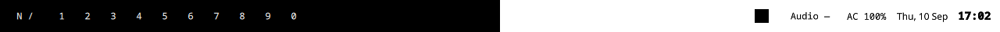
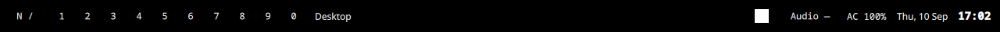
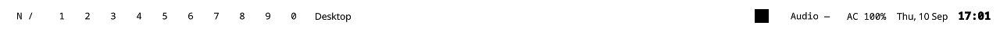

# nixos-setup

Personal Home Manager dotfiles for Hyprland, with a Quickshell status bar.
The existing Hyprland layout, animations, gestures, and keybindings are preserved.
Super R opens Vicinae, matching the installed launcher.



## Install on your desktop

Requires Nix with flakes, Linux, and a **Lua-capable Hyprland** (the version in
our locked nixos-unstable). This is a home configuration, not a complete NixOS
installer: keep your existing hardware, bootloader, users, and networking config.
Older Hyprland releases using only `hyprland.conf` cannot load this configuration.

```bash
git clone https://github.com/YOUR-USERNAME/nixos-setup.git
cd nixos-setup
cp examples/local.nix local.nix
# Edit local.nix: username, homeDirectory, system.
./scripts/install.sh           # Build without activating
./scripts/install.sh --switch  # Apply to the target user's home
```

Run activation as your normal user, on the desktop you want to configure.
`local.nix` is ignored by Git. The installer uses `path:` so this local file is
included when Nix evaluates the flake. Dependencies are pinned in `flake.lock`.
Keep `home.stateVersion` at the version used for your first Home Manager setup;
if importing into an older setup, retain its existing value.

Home Manager stops on conflicting unmanaged files. Back up or move only the files
it reports, then retry. Do not use sudo or delete your entire `.config` directory.
Log out and select Hyprland after the first activation. The bar starts with the
compositor. To start it in an already running Hyprland session:

```bash
quickshell -c nixos-setup
```

On NixOS, import `modules/nixos/desktop.nix` from your existing system configuration
(or use the flake's `nixosModules.desktop`). Rebuild the system separately. This
provides Hyprland, PipeWire and UPower; Home Manager deliberately uses the system
compositor. Use nixos-unstable matching the lock for the Lua configuration.

Already using Home Manager? Import this repository's `home.nix` or
`homeManagerModules.default` into your existing configuration instead of using the
standalone installer. Keep your username/home directory in your existing module,
and reconcile any existing Kitty, Hyprland, or Vicinae configuration first.

## Files

```text
flake.nix / flake.lock       Entry points and pinned dependencies
home.nix                    Shared Home Manager imports and state version
modules/home/hyprland.nix    Compositor, animations, bindings, bar startup
modules/home/programs.nix    Kitty, Vicinae, fonts and desktop utilities
modules/home/quickshell.nix  Installs the bar through Home Manager
modules/nixos/desktop.nix    Optional NixOS system prerequisites
config/quickshell/           QML source, reusable buttons and theme
examples/local.nix          Machine identity template
scripts/install.sh          Build and optional activation
scripts/check.sh            Shell lint, Nix parsing and flake evaluation
```

## Status bar

A transparent 42-pixel panel on each display. Workspaces 1–10 sit on the left;
the window title uses the remaining space, followed by the system tray, audio, battery, date and
24-hour clock. The date hides on smaller displays. Window titles truncate instead
of pushing controls outside the bar.

- Click a workspace to focus it (0 means workspace 10).
- Click `N /` to open Vicinae.
- Tray icons: left-click to activate (or open menu-only items), right-click for
  the app menu, middle-click for its secondary action, and scroll for app controls.
  The tray hides when no applications register icons.
- Click volume to mute; scroll to adjust in 5% steps, capped at 100%.
- Battery appears only when UPower reports a present battery; low charge is bold and prefixed with `!`.
- Missing audio displays `Audio —` and disables the control.

Text, tray icons, focus outlines and hover highlights adapt to the local background:
white over dark areas, black over light areas. Tray icons preserve their shape and
transparency while becoming monochrome.




Every two seconds, Grim captures the bar region in memory. The sampler reads the
outer two pixel rows in 64-pixel sections, away from the bar's own controls, and
uses linear luminance with hysteresis to avoid feedback and flicker. Each control
uses the section behind its center. This approximates the background behind the
controls; very detailed wallpapers can vary between the sampled edges and text.
It works independently for each monitor and follows wallpaper changes without
configuring a wallpaper path. Captures are not saved to disk.

Requires compositor screen capture support and Grim/Python/Pillow, installed by
the Home Manager module. If capture fails, the previous colors remain (initially
white) and Quickshell logs a warning. Qt's normal GPU/OpenGL renderer is required
for tray tinting; do not force `QT_QUICK_BACKEND=software`.

Edit `config/quickshell/Theme.qml` for foreground colors, fonts and sampling interval,
`Bar.qml` for layout, or `sample-background.py` for sampling.
Home Manager copies sources into the Nix store; rebuild to apply repository edits.
For live development, run `quickshell -p ./config/quickshell` in Hyprland after
stopping the installed instance (`quickshell -c nixos-setup kill`).

## Develop inside Toolbox

All development and validation for this repository was performed in the
`nixos-setup` container. Toolbox shares this checkout with the host.

```bash
toolbox create --container nixos-setup --assumeyes  # Once, if it does not exist
toolbox enter nixos-setup
sudo dnf install -y nix quickshell qt6-qtdeclarative-devel ShellCheck git python3 python3-pillow grim
sudo bash scripts/check.sh
python3 -m unittest discover -s tests
```

Fedora's Nix package uses a root-owned container store. The sudo check command
only builds/evaluates in that store; it does not activate Home Manager. The
container's Nix store is separate from your target desktop's store. Do not run
`install.sh --switch` in the development container: its shared home and isolated
store are not the desktop installation environment.

GitHub Actions runs the same shell and Nix checks. To build every check as well:

```bash
nix --extra-experimental-features 'nix-command flakes' flake check "path:$PWD"
```

Update dependencies intentionally with `nix flake update`, rerun the checks,
and commit `flake.lock`. Inspect `git diff` before uploading; do not commit
credentials, machine hardware configuration, or `local.nix`.

## References

- [Home Manager](https://github.com/nix-community/home-manager)
- [Hyprland Lua example](https://github.com/hyprwm/Hyprland/blob/main/example/hyprland.lua)
- [Quickshell documentation](https://quickshell.org/docs/)

## Validation performed

- ShellCheck and parsing of every Nix file passed.
- The locked Home Manager activation derivation evaluated successfully.
- Quickshell loaded and rendered on an isolated headless Wayland compositor.
- The tray component passed QML lint and displayed a real Qt tray application
  on a private D-Bus session (the monochrome square in the previews).
- The generated Hyprland Lua contains the bar startup hook.
- Dark, light and split backgrounds rendered with adaptive text and tray icons.
- Sampler tests cover luminance, local contrast, partial sections and foreground isolation.

The preview uses a headless Sway session, so workspace focus and live PipeWire
controls were not exercised. A complete Nix package build and activation on a
real Hyprland desktop remain to be tested.
